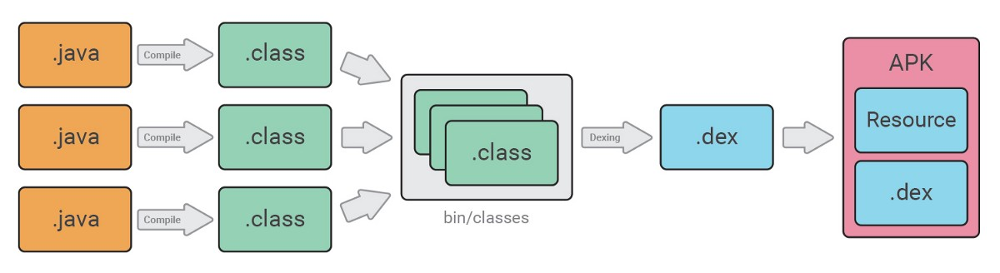
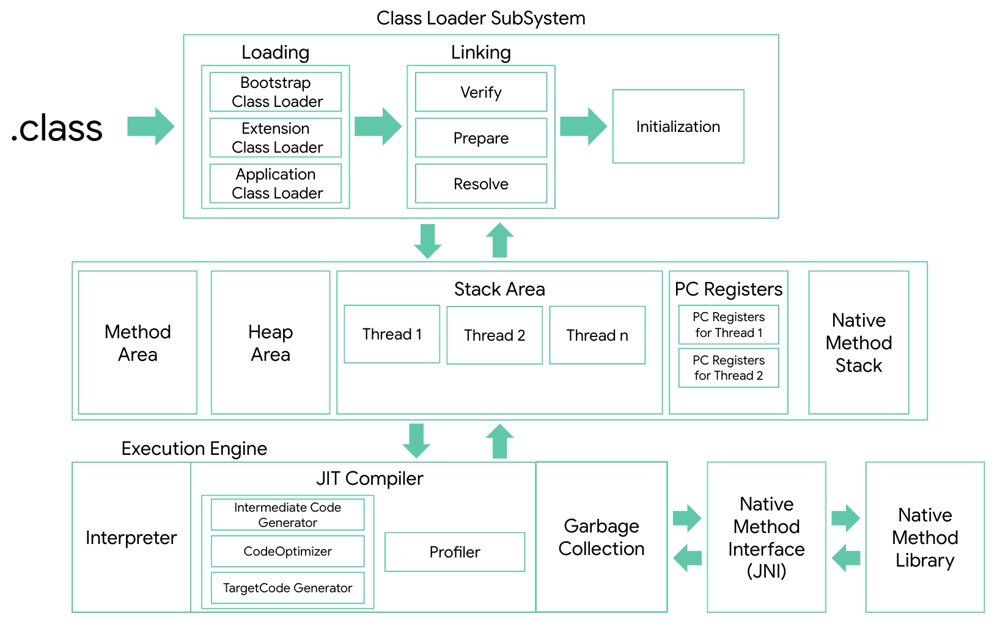
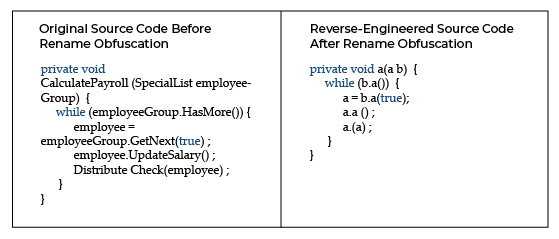
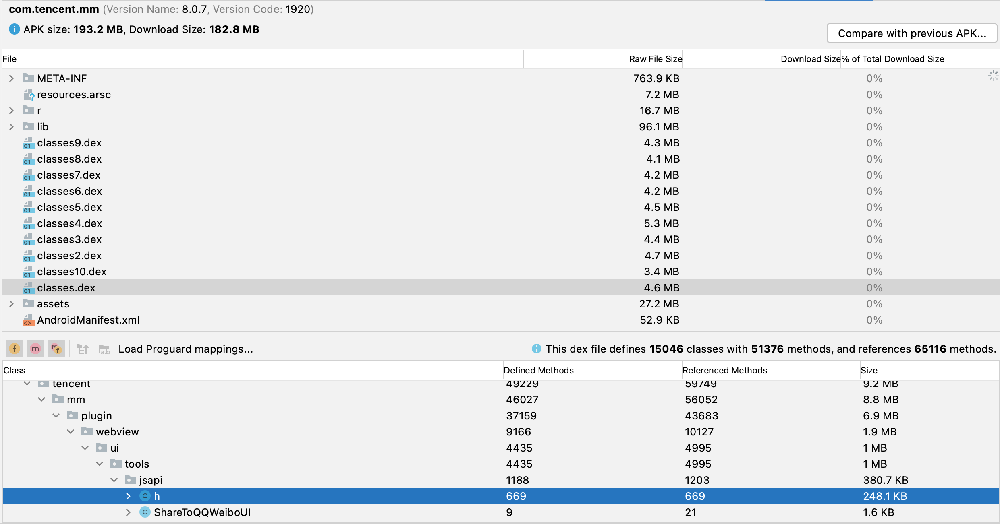
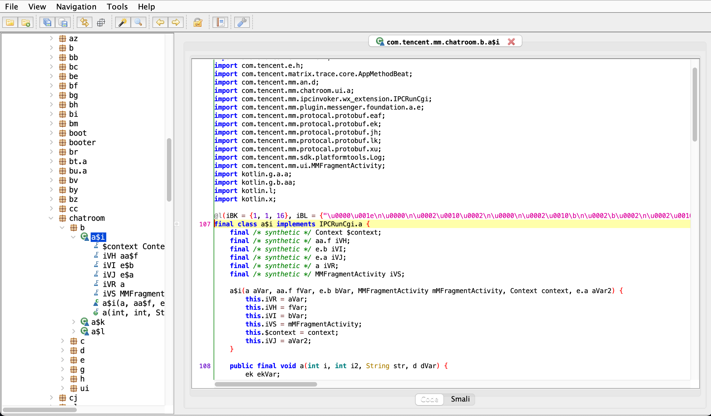
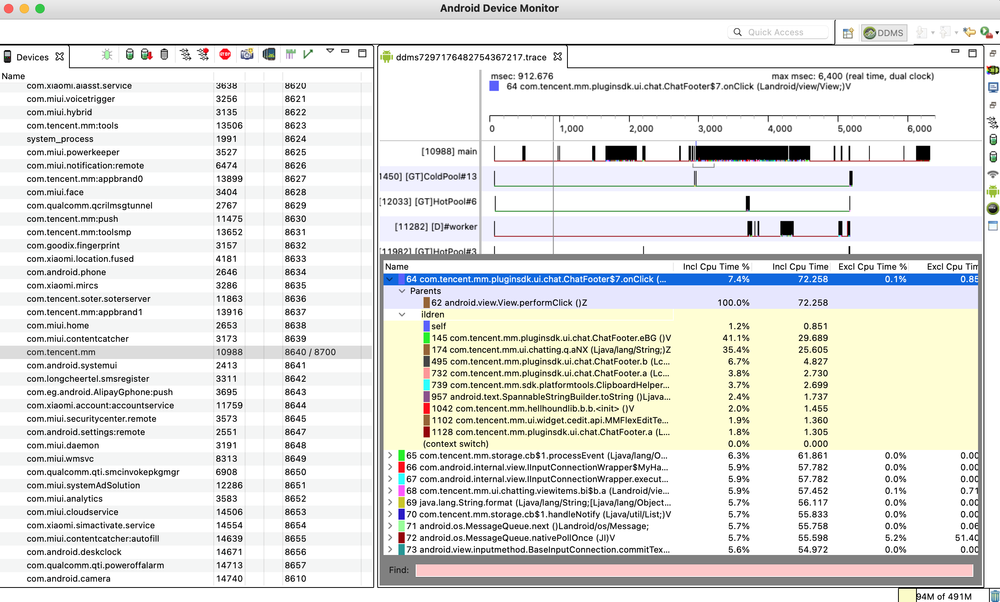
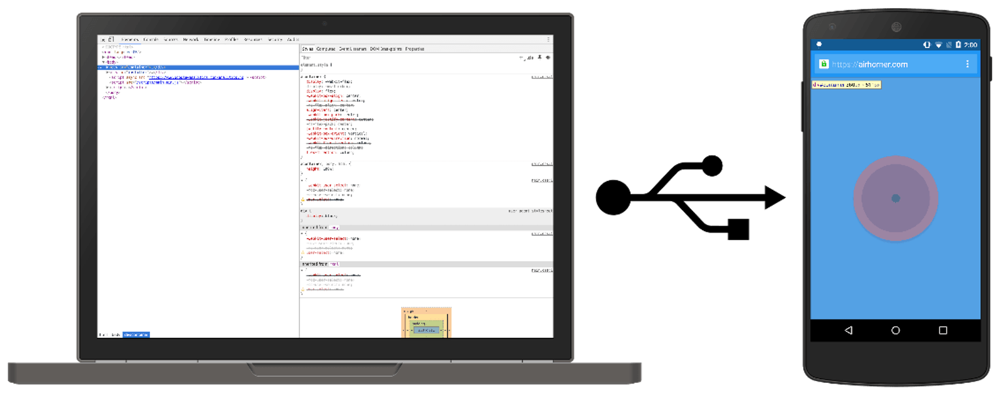
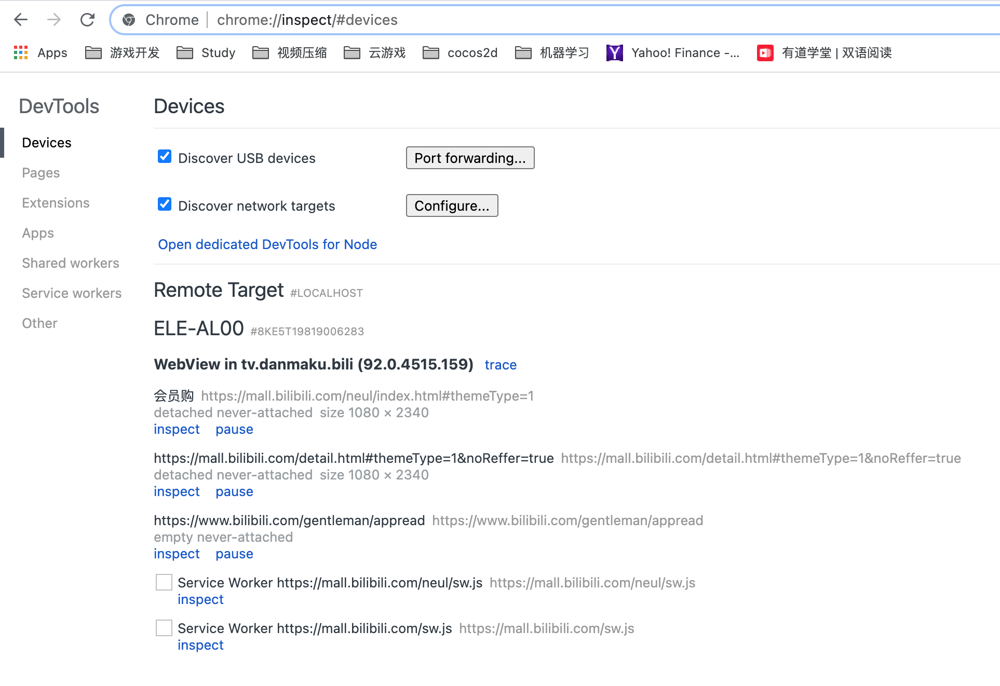
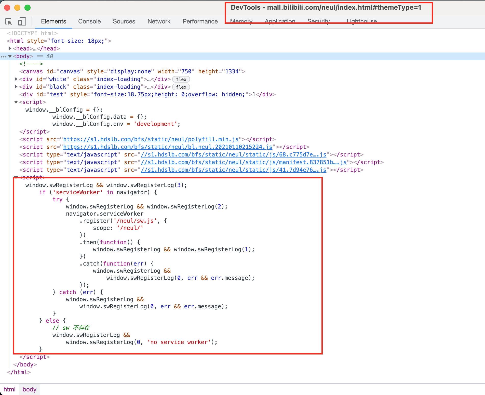

## 1. 微信爬取公众号链接

2015年底来公司的第一个任务: 
> 爬取手机微信公众号的链接

当时参考的微信抢红包的通用方案: Android的Accessibility辅助功能, 通过Accessibility模拟点击微信每一篇公众号, 并通过通过公众号右上角的复制链接功能, 将链接复制到剪切板里, 之后读取剪切板, 从而得到对应的链接. 

虽然流程ok, 但是不稳定, 特殊情况太多, 新消息来了不好处理, 手机卡了之后容易模拟操作失败...

现在剩下的就是微信号里关注了100+股票相关的公众号...

有更厉害的方法!

## 2. Xposed

> Xposed框架(Xposed Framework)是一套开源的、在Android`高权限模式`下运行的框架服务，可以在不修改APK文件的情况下影响程序运行(修改系统)的框架服务，基于它可以制作出许多功能强大的模块，且在功能不冲突的情况下同时运作[1]。

简单来说, 你可以修改你的Android手机上安装的任意程序做任意的修改，调用程序的方法, 监听Hook程序的方法, 来达到修改微信步数，抢红包，微信聊天斗图。。。但是有个前提就是`高权限模式`也就是`ROOT`，你需要一个支持`ROOT`的手机，目前自带支持`ROOT`的手机如小米，一加，三星等。

### 2.1 VirtualApp和VirtualXposed
* VirtualApp


高中大神Lody[2]的`VirtualApp`[3]出现了, 通过Hook、反射可以在你手机上构建一个虚拟的App运行环境，就像一个沙盒一样，以此达到`ROOT`的效果。
> VirtualApp(以下简称：VA)是一款运行于Android系统的沙盒产品，可以理解为轻量级的“Android虚拟机”。其产品形态为高可扩展，可定制的集成SDK，您可以基于VA或者使用VA定制开发各种看似不可能完成的项目。VA目前被广泛应用于APP多开、手游境外加速、手游租号、手游手柄免激活、区块链、移动办公安全、军队政府数据隔离、手机模拟信息、脚本自动化、插件化开发、无感知热更新、云控等技术领域。

* VirutalXposed

> VirtualXposed 是基于VirtualApp 和 epic 在非ROOT环境下运行Xposed模块的实现（支持5.0~10.0)。[4]

通过VirtualXposed你可以在VirtualApp环境下，在非ROOT的手机上安装Xposed插件！

下载直接安装 
> https://github.com/asLody/SandVXposed

### 2.2 Xposed插件

#### 2.2.1 网上有专门的Xposed插件仓库: 
 
> https://repo.xposed.info/module/de.robv.android.xposed.installer

#### 2.2.2 支持的方法:

* findAndHookMethod, 找到某个类的方法, 当他调用时能够监听Hook到.

```
findAndHookMethod(Activity.class, "onCreate", Bundle.class, new XC_MethodHook() {
            @Override
            protected void beforeHookedMethod(MethodHookParam param) throws Throwable {
                Activity activity = (Activity) param.thisObject;
                activity.getWindow().addFlags(WindowManager.LayoutParams.FLAG_KEEP_SCREEN_ON);
            }
});
```

* callMethod, 调用某个类实例的方法

```
callMethod(requestCaller, VersionParam.con_NetworkMethod, textMessageRequest, delay);
```

*  callStaticMethod, 调用某个类的静态方法

```
callStaticMethod(findClass(VersionParam.networkRequest, classLoader), VersionParam.requestMethod);
```

## 3. Get Started

下面讲一下如何使用VirtualApp和VirtualXposed "破解"Android程序。

### 3.1 Android的一些基础细节
* APK打包流程



* APK执行流程



* 代码混淆Obfuscation



### 3.2 Android Studio


Android开发IDE, 集成很多辅助工具, 其中`Analyze APK`功能能够直接分析一个APK安装包的内容, 看到项目的大致结构. 下图为微信v8.0.7版本安装包分析内容.



### 3.3 JADX


能够将.dex文件直接转化成.class文件, 就能看到项目的源代码了! 下图为微信v8.0.7版本的其中一个classes.dex的分析结果.



### 3.4 DDMS


Davlik Debug Monitor Server(DDMS)或直接使用Android Studio可以通过traceview来跟踪记录Android手机上方法调用的链路, 从而能够轻松的找到你要破解的App的代码方法, 之后通过Xposed来Hook和执行.

### 3.4 Root手机
当然你需要一个能够获取Root权限的手机.

## 3. "破解"微信

如何让微信通过代码自动发送消息?

> 答: 找到发送消息的方法, 通过Xposed模拟调用一下.

所以我们要做的就是找到这个方法.

### 3.1 模拟发送文本消息

先连接`ROOT`手机, 启动`DDMS`, 输入内容, 点击发送按钮, 发送一条消息, 记录的方法堆栈如下:



#### 猜测微信如何写代码?

如果你写代码, 应该会封装一个方法发送微信消息, 这个方法的参数应该就是个String类型的值, 顺着`onClick`点击方法堆栈往下找找到下面的方法:

> com.tencent.mm.ui.chatting.d.bb.hL

通过jadx找到对应方法的class源码具体内容如下:

```
 private boolean hL(String str, final int i) {
    int i2 = 0;
    AppMethodBeat.i(35586);
    final String filterString = Util.getFilterString(str);
    if (filterString == null || filterString.length() == 0) {
        Log.e("MicroMsg.ChattingUI.SendTextComponent", "doSendMessage null");
        AppMethodBeat.o(35586);
        return false;
    }
    cn cnVar = new cn();
    cnVar.fyi.fyk = filterString;
    cnVar.fyi.context = this.fgR.WQv.getContext();
    cnVar.fyi.username = this.fgR.getTalkerUserName();
    EventCenter.instance.publish(cnVar);
    if (cnVar.fyj.fyl) {
        AppMethodBeat.o(35586);
        return true;
    }
    boolean z = WXHardCoderJNI.hcSendMsgEnable;
    int i3 = WXHardCoderJNI.hcSendMsgDelay;
    int i4 = WXHardCoderJNI.hcSendMsgCPU;
    int i5 = WXHardCoderJNI.hcSendMsgIO;
    if (WXHardCoderJNI.hcSendMsgThr) {
        i2 = h.aHJ().getProcessTid();
    }
    this.WOv = WXHardCoderJNI.startPerformance(z, i3, i4, i5, i2, WXHardCoderJNI.hcSendMsgTimeout, g.SCENE_SEND_MSG, WXHardCoderJNI.hcSendMsgAction, "MicroMsg.ChattingUI.SendTextComponent");
    com.tencent.mm.ui.chatting.e.a.hRl().post(new Runnable() {
        /* class com.tencent.mm.ui.chatting.d.bb.AnonymousClass1 */

        public final void run() {
            AppMethodBeat.i(35582);
            if (bb.this.fgR == null) {
                Log.w("MicroMsg.ChattingUI.SendTextComponent", "NULL == mChattingContext");
                AppMethodBeat.o(35582);
                return;
            }
            com.tencent.mm.plugin.report.service.g.ada(20);
            if (bb.a(bb.this)) {
                bb.this.fgR.getSelfUserName();
                bh.aGY().a(new com.tencent.mm.au.a(bb.this.fgR.NKq.field_username, filterString), 0);
                AppMethodBeat.o(35582);
                return;
            }
            if (bb.this.fgR.bC(k.class).getCount() == 0 && as.bvJ(bb.this.fgR.getTalkerUserName())) {
                cg.bfp().e(10076, new Object[]{1});
            }
            String talkerUserName = bb.this.fgR.getTalkerUserName();
            if (Util.isNullOrNil(talkerUserName)) {
                Log.e("MicroMsg.ChattingUI.SendTextComponent", "toUser is null or nil!");
                AppMethodBeat.o(35582);
                return;
            }
            int QZ = ab.QZ(talkerUserName);
            String str = filterString;
            String str2 = null;
            try {
                str2 = bb.this.fgR.bC(ac.class).bzn(talkerUserName);
            } catch (NullPointerException e) {
                Log.printErrStackTrace("MicroMsg.ChattingUI.SendTextComponent", e, "", new Object[0]);
            }
            if (Util.isNullOrNil(str2)) {
                Log.w("MicroMsg.ChattingUI.SendTextComponent", "tempUser is null");
                AppMethodBeat.o(35582);
                return;
            }
            u bC = bb.this.fgR.bC(u.class);
            o.e wD = o.WI(str2).wD(QZ);
            wD.cUP = bC.hPj().ht(talkerUserName, i);
            wD.content = str;
            wD.toUser = str2;
            wD.lUp = bC.hPj().nt(talkerUserName, str);
            wD.lUq = 5;
            o.b bnl = wD.bnl();
            com.tencent.mm.modelmulti.i iVar = bnl.lUi;
            if (iVar instanceof com.tencent.mm.modelmulti.i) {
                bb.this.fgR.bC(ac.class).g(iVar);
            }
            bnl.aEv();
            if (ab.QT(talkerUserName)) {
                bh.aGY().a(new m(q.auR(), filterString + " key " + cl.hAM() + " local key " + cl.hAL() + "NetType:" + NetStatusUtil.getNetTypeString(bb.this.fgR.WQv.getContext().getApplicationContext()) + " hasNeon: " + n.aux() + " isArmv6: " + n.auz() + " isArmv7: " + n.auy()), 0);
            }
            AppMethodBeat.o(35582);
        }
    });
    this.fgR.Gi(true);
    AppMethodBeat.o(35586);
    return true;
}
```

其中可以猜测出:
> bh.aGY().a(new com.tencent.mm.au.a(bb.this.fgR.NKq.field_username, filterString), 0);

是发送消息的方法. 其中参数为`com.tencent.mm.au.a`类型, 并且构造函数明显就是发送的用户, 以及发送的字符串.

```
public a(String str, String str2) {
    boolean z = true;
    AppMethodBeat.i(20484);
    this.fvt.setStatus(1);
    this.fvt.Jm(str);
    this.fvt.setCreateTime(bq.RP(str));
    this.fvt.pJ(1);
    this.fvt.setContent(str2);
    this.fvt.setType(ab.QZ(str));
    bh.beI();
    long aM = c.bbO().aM(this.fvt);
    Assert.assertTrue(aM == -1 ? false : z);
    Log.i("MicroMsg.NetSceneSendMsgFake", "new msg inserted to db , local id = ".concat(String.valueOf(aM)));
    AppMethodBeat.o(20484);
}
```

所以最终模拟发送消息的调用流程如下:

```
// 构建发送消息方法
requestCaller = XposedHelpers.callStaticMethod(findClass("com.tencent.mm.model.bh", classLoader), "aGY");
// 构建发送对象
Object textMessageObject = XposedHelpers.newInstance(findClass("com.tencent.mm.au.a", classLoader), username, sendString);
// 发送
XposedHelpers.callMethod(requestCaller, "a", textMessageObject, 0);
```

### 3.2 TODO 模拟发送动图消息


## 4. 浏览器Debug

众所周知Android手机可以和在PC上一样通过`F12`或`右键 -> Inspect`来查看我们写的前端页面, 并且能够Debug页面[6].



但是有个前提, 必须是开启了Debug模式

```
if (ApplicationInfo.FLAG_DEBUGGABLE) {
	webview.setWebContentsDebuggingEnabled(true);
}
```

这个模式一般App的开发者都会加上只在Debug的环境下才能打开的限制, 也就是我们所谓的Debug包才能连接PC看到网页`Inspect`. 

那么我们能够在非Debug包的环境下, 也就是去应用市场上下个包来`Inspect`他们的页面, 看一下他们是怎么写网页吗?

当然, 通过`VirtualXposed`就可以做到.

```
import android.content.Context;

import de.robv.android.xposed.IXposedHookLoadPackage;
import de.robv.android.xposed.XC_MethodHook;
import de.robv.android.xposed.XposedHelpers;
import de.robv.android.xposed.callbacks.XC_LoadPackage;

public class CrackWebViewModule implements IXposedHookLoadPackage {
    @Override
    public void handleLoadPackage(XC_LoadPackage.LoadPackageParam lpparam) throws Throwable {
        XposedHelpers.findAndHookConstructor(XposedHelpers.findClass("android.webkit.WebView", lpparam.classLoader),
                Context.class,
                new XC_MethodHook() {
                    @Override
                    protected void beforeHookedMethod(MethodHookParam param) throws Throwable {
                        super.beforeHookedMethod(param);
                        XposedHelpers.callStaticMethod(XposedHelpers.findClass("android.webkit.WebView", lpparam.classLoader),
                                "setWebContentsDebuggingEnabled", true);
                    }
                    @Override
                    protected void afterHookedMethod(MethodHookParam param) throws Throwable {
                        super.afterHookedMethod(param);
                    }
                });

    }
}

```

构建之后, 安装到`SandXposed`上, 克隆运行`bilibili`, 我们可以看到`会员购`页面使用了网页来实现, 并且还用上了`ServiceWorker`





所以之后调试页面不用让别人给我们打包了！

## 5. 前端安全


[1] https://baike.baidu.com/item/Xposed%E6%A1%86%E6%9E%B6/16859077

[2] https://www.infoq.cn/news/2016/05/lody-interview

[3] https://github.com/asLody/VirtualApp

[4] https://github.com/android-hacker/VirtualXposed

[5] https://medium.com/androiddevnotes/the-internals-of-android-apk-build-process-article-5b68c385fb20

[6] https://developer.chrome.com/docs/devtools/remote-debugging/

[7] https://www.preemptive.com/obfuscation