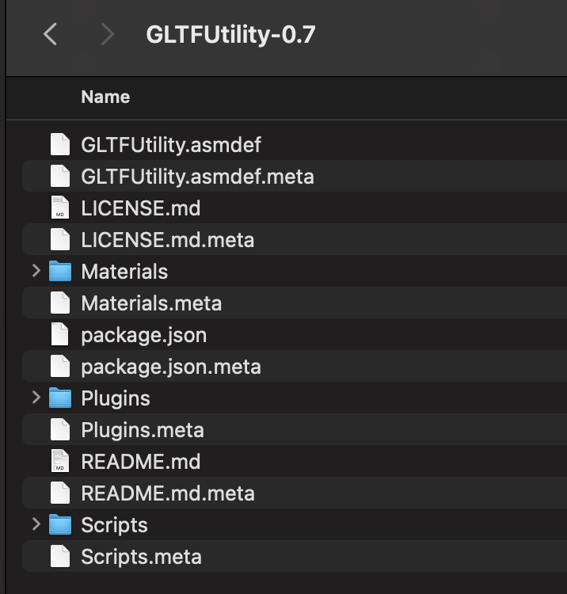
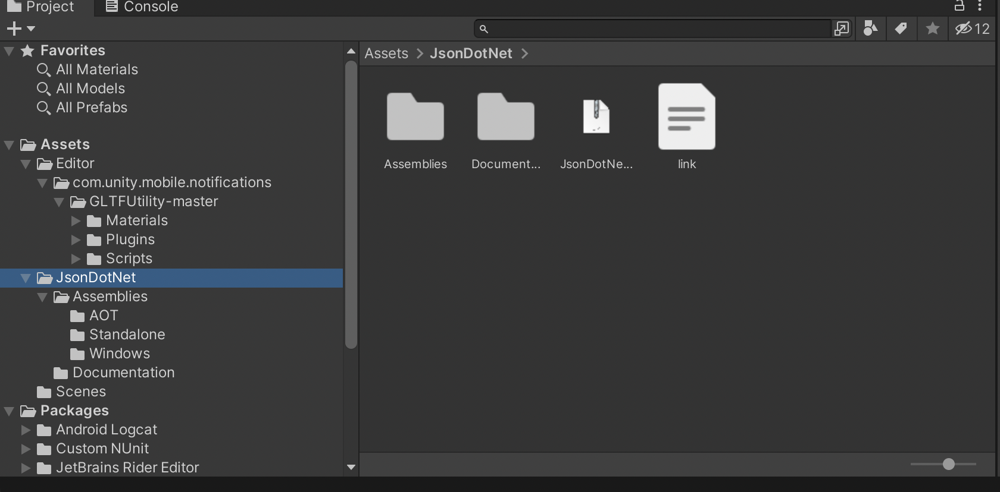

## 1. 插件

Github: [https://github.com/Siccity/GLTFUtility](https://github.com/Siccity/GLTFUtility)

## 2. 下载release安装

直接拖拽到Unity Project中

## 3. 需要额外安装JsonDotNet

直接进入Unity Assets Store下载: [https://assetstore.unity.com/packages/tools/input-management/json-net-for-unity-11347](https://assetstore.unity.com/packages/tools/input-management/json-net-for-unity-11347)

## 4. 导入gltf模型文件

[1] https://www.youtube.com/watch?v=118fwEtlocU